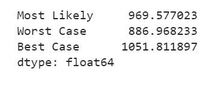

# Module 11 Challenge: Forecasting Net Prophet

---

## Files

These files are used in order to complete this project:

[Forecasting Net Prophet notebook](forecasting_net_prophet.ipynb) - Jupyter Notebook contains code to solves the questions. Or it can be viewed online via Google Colab [here](https://colab.research.google.com/drive/1qEBN6kMmZFo6oGH3PfrqYWymWqKrPmSu?usp=sharing).

[Data files](Starter_code/Resources) - Data provided.

---

## Findings:

### **1: Find Unusual Patterns in Hourly Google Search Traffic** 

1. Read the search data into a DataFrame, and then slice the data to just the month of May 2020. (During this month, Mercado Libre released its quarterly financial results.) Use hvPlot to visualise the results. The search trend does not have any remarkable unsual pattern.

Search trend during May 2020.

2. The total traffic of May 2020 was 38,181. This number is much higher to 35,172.5 of median monthly traffic. Hence, the search traffic did increase during the month that MercadoLibre released its financial results.

### **2: Mine the Search Traffic Data for Seasonality**

The Marketing department realises that they can use the hourly search data, too. If they can track and predict interest in the company and its platform for any time of day, they can focus their marketing efforts around the times that have the most traffic. This will get a greater return on investment (ROI) from their marketing budget.

1. Group the hourly search data to plot the average traffic by the day of the week. 

2. Using hvPlot, visualise this traffic as a heatmap, referencing `index.hour` for the x-axis and `index.dayofweek` for the y-axis. We can see that the concentrate is observed from 10pm to 2am from almost all days of the week.?

3. Group the search data by the week of the year. The search traffic tends to increase during the winter holiday period (weeks 40 through 52). But there would be a drop by around week 51.

### **3: Relate the Search Traffic to Stock Price Patterns**

During a meeting with people in the Finance group, you mention your work on the search traffic data. They want to know if any relationship between the search data and the company stock price exists, and they ask if you can investigate.

1. Note that market events emerged during 2020 that many companies found difficult. But after the initial shock to global financial markets, new customers and revenue increased for e-commerce platforms. So, slice the data to just the first half of 2020 (`2020-01` to `2020-06` in the DataFrame), and then use hvPlot to plot the data. 

We can see that the trends are quite different when the "Search Trends" was relatively consistent over time wheras the "close" price observed a drop from Mar to Apr 2020 then a steady increasing trend after that. However, it is noticable that the "Search Trends" also dropped and jumped dramatically at the same period of time in line with the stock price i.e. Mar-Apr 2020 and early May 2020.

2. Plot out the correlations between "Stock Volatility", "Lagged Search Trends", and "Hourly Stock Return".

There seems to be no predictable relationship between "Lagged Search Trends" and "Stock Volatility", and between "Lagged Search Trends" and "Hourly Stock Return". The correlations value are low.

### **4: Create a Time Series Model by Using Prophet**

1.Near-term forecast for the popularity of Mercado Libre is a decline trend in the next 2,000 hours.

2. Plot the individual time series components of the model

   * What time of day exhibits the greatest popularity? - Around midnight.

   * Which day of the week gets the most search traffic? - Tuesday

   * What's the lowest point for search traffic in the calendar year? - Around October

### **5: Forecast the Revenue by Using Time Series Models**

1. Interpret the model output to identify any seasonal patterns in the company revenue. 

We can see that "Revenue" likely gets it's peak by Wednesday and will declines gradually to Saturday then will increase steadily again.

2. Produce a sales forecast for the finance group. 

   Best case scenario: $1,051.81 mil.
   Most likely scenario: $969.57 mil.
   Worst case scenario:  $886.96 mil.
---
